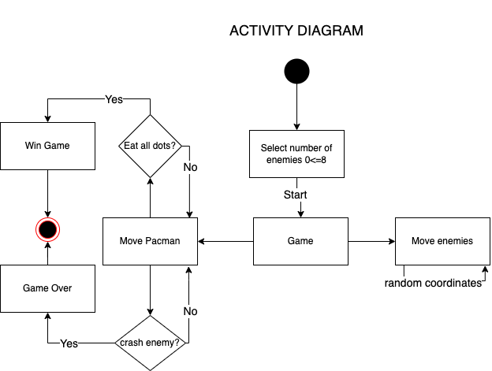

Architecture Document
=========================================

Stucture of types
----------------------
**game:** 
- score   int: Starts on 0 and every time the pacman eats a dot this increments. 
- scene   *scene: Screen where all the GUI items are display.
- mode    Mode: flags for the game
- enemies []*Enemy: Array with references to the enemies.
- player  *Pacman: Reference to the pacman in the game.

**pacman:** 
- sprite           *ebiten.Image: Reference to png of the pacman image
- dir     direction: actuall direction of the pacman 
- nextDir     direction: the next movement direction based on user inputs
- x, y             int: x and y possitions of the pacman
- targetX, targetY int: next x and y possitions of the pacman 
- game             *Game: referece to the Game where the pacman is playing

**enemy:** 
- dir              direction: actual direction of the enemy 
- nextDir          chan direction: Channel that stores the next direction movement for the enemy based on a random function 
- targetX, targetY int: next x and y possitions of the enemy
- game             *Game: referece to the Game where the enemy is display
- xPos, yPos             int: x and y actual possitions of the enemy
- color            [4]float64: color of the enemy

**scene:** 
- stage *stage: stage/map of the game 

**stage:** 
- tile_matrix []string: matrix where the initial coordinates of items are defined

ACTIVITY DIAGRAM
----------------------

