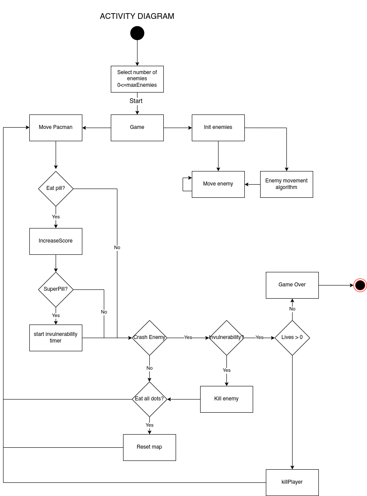

Architecture Document
=========================================

Stucture of types
----------------------

**game:**

- score   int: Starts on 0 and every time the pacman eats a dot or an enemy this increments.
- scene   *scene: Screen where all the map information is stored.
- mode    Mode: flags for the game
- enemies []*Enemy: Array with references to the enemies.
- player  *Pacman: Reference to the pacman in the game.
- numEnemies int: number of enemies in the game. It  should be bigger than 1 and less than the maximun number in tha scene.
- lives int: number of lives pacman have, 3 by default.
- isSuperPilled bool: variable to see if pacman should die o kill an enemy.

**pacman:**

- dir direction: actual direction pacman is moving.
- nextDir direction: the next movement direction based on user inputs.
- prevDir direction: the last direction pacman was moving.
- x, y int: x and y possitions of the pacman.
- initX, InitY int: starting x and y possitions of the pacman, used for reset when dead.
- targetX, targetY int: the x and y coordinates of where is pacman trying to go.
- game *Game: referece to the Game used for comunication.
- sprite [][]*ebiten.Image: reference to all the sprites needed to animate pacman.

**enemy:**

- dir direction: actual direction where the enemy is moving.
- nextDir chan direction: Channel used to recive instructions from the movement algorithm.
- nextDir chan direction: Channel used to stop the movement algorithm.
- targetX, targetY int: x and y where the enemy is trying to go.
- game *Game: referece to the Game used for comunication.
- x, y int: x and y actual possitions of the enemy.
- initialX, initialX int: starting x and y used for reseting.
- color [4]float64: color mask applied to the sprite.
- sync.Mutex: mutex used to avoid data races with the movement algorithm

**scene:**

- stage [][]tile: matrix where all the pills, super pills and walls are
  stored
- originalStage [][]tile: copy of the stage used to restore the map when
  the player passes the level or after a gameover.
- remainingPills int: number of pills remaining in the map.
- totalPills int: number of pills in the map also used to reset the map.
- pacmanInitalX int: start x position of pacman in this map.
- pacmanInitalY int: start y position of pacman in this map.
- enemiesPositions [][]int: array containing all the initial positions
  for enemies in this map.

ACTIVITY DIAGRAM
----------------------

SECUENTIAL DIAGRAM
----------------------

